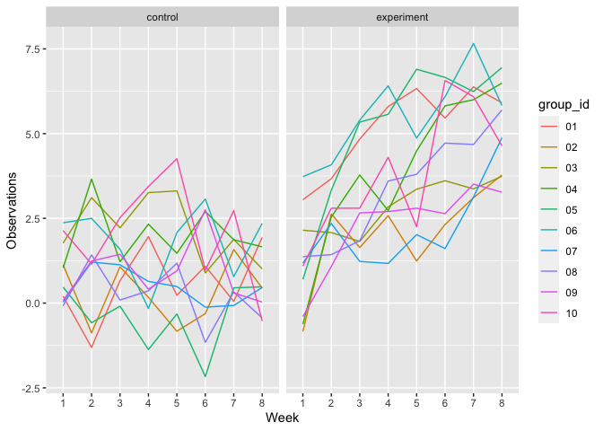
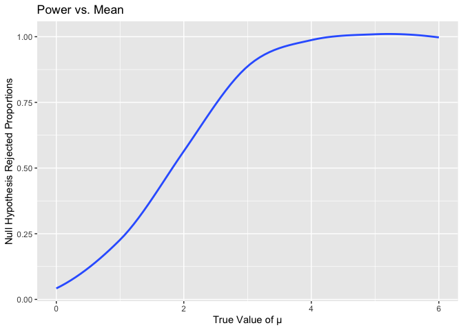
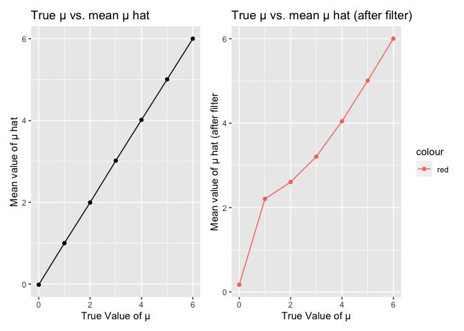

Homework 5
================
Chong Li

# Problem 1

The raw data describes the victim characteristics of murder cases
(name/race/age/sex), the location where the murders took place
(state/city/lat/lon), the identifiers of the cases and the reported
date, and lastly, the disposition of the case (close or open/arrest or
no arrest)

``` r
# Read in the csv file and add the city_state variable, as well as variable for open/no arrest
homicide_df = read.csv("./homicide-data.csv") %>%
  janitor::clean_names() %>%
  mutate(city_state = str_c(city,state,sep=",")) %>% 
  relocate(city_state, .before=lat)  %>%
  mutate(unsolved = (grepl("Closed without arrest",disposition,ignore.case=TRUE) |
                       grepl("Open/No arrest",disposition,ignore.case=TRUE)))

head(homicide_df) %>% kable()
```

| uid        | reported\_date | victim\_last | victim\_first | victim\_race | victim\_age | victim\_sex | city        | state | city\_state    |      lat |        lon | disposition           | unsolved |
| :--------- | -------------: | :----------- | :------------ | :----------- | :---------- | :---------- | :---------- | :---- | :------------- | -------: | ---------: | :-------------------- | :------- |
| Alb-000001 |       20100504 | GARCIA       | JUAN          | Hispanic     | 78          | Male        | Albuquerque | NM    | Albuquerque,NM | 35.09579 | \-106.5386 | Closed without arrest | TRUE     |
| Alb-000002 |       20100216 | MONTOYA      | CAMERON       | Hispanic     | 17          | Male        | Albuquerque | NM    | Albuquerque,NM | 35.05681 | \-106.7153 | Closed by arrest      | FALSE    |
| Alb-000003 |       20100601 | SATTERFIELD  | VIVIANA       | White        | 15          | Female      | Albuquerque | NM    | Albuquerque,NM | 35.08609 | \-106.6956 | Closed without arrest | TRUE     |
| Alb-000004 |       20100101 | MENDIOLA     | CARLOS        | Hispanic     | 32          | Male        | Albuquerque | NM    | Albuquerque,NM | 35.07849 | \-106.5561 | Closed by arrest      | FALSE    |
| Alb-000005 |       20100102 | MULA         | VIVIAN        | White        | 72          | Female      | Albuquerque | NM    | Albuquerque,NM | 35.13036 | \-106.5810 | Closed without arrest | TRUE     |
| Alb-000006 |       20100126 | BOOK         | GERALDINE     | White        | 91          | Female      | Albuquerque | NM    | Albuquerque,NM | 35.15111 | \-106.5378 | Open/No arrest        | TRUE     |

``` r
# count the total number of murder cases as well as unsolved murder cases
cases_df = homicide_df %>%
  count(city_state,name = "cases")

unsolved_df = homicide_df %>%
  filter(unsolved == TRUE) %>%
  count(city_state,name = "unsolved_cases")

sum_df = merge(cases_df,unsolved_df,by.x="city_state",by.y="city_state")

head(sum_df) %>% kable()
```

| city\_state    | cases | unsolved\_cases |
| :------------- | ----: | --------------: |
| Albuquerque,NM |   378 |             146 |
| Atlanta,GA     |   973 |             373 |
| Baltimore,MD   |  2827 |            1825 |
| Baton Rouge,LA |   424 |             196 |
| Birmingham,AL  |   800 |             347 |
| Boston,MA      |   614 |             310 |

``` r
# for the city of Baltimore, use prop.test function to estimate unsolved cases
baltimore = sum_df %>% filter(city_state=="Baltimore,MD")
baltimore_prop = prop.test(baltimore$unsolved_cases,baltimore$cases) %>% 
  broom::tidy() %>% 
  select(estimate,conf.low,conf.high)

signif(baltimore_prop,3) %>% kable()
```

| estimate | conf.low | conf.high |
| -------: | -------: | --------: |
|    0.646 |    0.628 |     0.663 |

``` r
# run prop.test for each cities in the dataset
all_prop = sum_df %>%
  mutate(
    prop_test = map2(.x = unsolved_cases, .y = cases, ~prop.test(.x,.y)),
    prop_test_tidy = map(.x = prop_test, ~broom::tidy(.x))
  ) %>%
  select(city_state,prop_test_tidy) %>%
  unnest(prop_test_tidy) %>%
  arrange(desc(estimate)) %>%
  select(city_state,estimate,conf.low,conf.high) %>%
  mutate(across(is.numeric, ~ round(., 4)))

head(all_prop) %>% kable()
```

| city\_state       | estimate | conf.low | conf.high |
| :---------------- | -------: | -------: | --------: |
| Chicago,IL        |   0.7359 |   0.7240 |    0.7474 |
| New Orleans,LA    |   0.6485 |   0.6231 |    0.6732 |
| Baltimore,MD      |   0.6456 |   0.6276 |    0.6632 |
| San Bernardino,CA |   0.6182 |   0.5577 |    0.6753 |
| Buffalo,NY        |   0.6123 |   0.5688 |    0.6541 |
| Miami,FL          |   0.6048 |   0.5686 |    0.6400 |

``` r
# create a graph based on the prop.test outputs above

all_prop %>%
  mutate(city_state = fct_reorder(city_state, estimate)) %>%
  ggplot(aes(x = city_state, y = estimate)) +
  geom_point() +
  geom_errorbar(aes(ymin = conf.low, ymax = conf.high)) +
  theme(axis.text.x = element_text(angle = 90, vjust = 0.5, hjust = 1)) +
  ggtitle("Proportion of Unsolved Murder Cases") +
  xlab("City") + ylab("Proportion Estimates")
```

<!-- -->

# Problem 2

``` r
# create a data frame that consists of all subjects and respective observations
study_df = 
  tibble(file_name = list.files("data")) %>%
  mutate(
    data = map(.x = str_c("./data/", file_name), ~read_csv(.x))) %>%
  unnest(data) %>%
  pivot_longer(
    week_1:week_8,names_to = "week",values_to = "observations") %>%
  mutate(
    arm_id = substr(file_name, 0, 3),group_id = substr(file_name, 5, 6)) %>%
  mutate(
      arm_id = case_when(arm_id == "con" ~ "control",arm_id == "exp" ~ "experiment"),
      week = substr(week,6,6)) %>%
  relocate(group_id,.before=week)%>%
  relocate(arm_id,.before=week) %>%
  select(-file_name)

# create a spaghetti plot showing observations on each subject
study_df %>%
  ggplot(aes(x = week, y = observations, group = group_id, color = group_id)) +
  geom_line() + facet_grid(~arm_id) +
  ylab("Observations") + xlab("Week") 
```

<!-- -->

From the graph, it is clear that the experimental group shows a strong
positive trend over the 8-week observation period while the control
group had a flat trend despite having fairly large fluctuation in
observation values.

# Problem 3

## Part 1

``` r
# function used to conduct t.test given the fixed n and fixed sigma at 30 and 5
hypothesis_fun = function(sample_size=30,mu_input,sigma=5) {
  sim_data  = 
    tibble(
      x = rnorm(n = sample_size, mean = mu_input, sd = sigma)
    ) %>%
    t.test(
      alternative="two.sided",
      mu=0, conf.level=0.95) %>%
    broom::tidy() %>%
    select(estimate,p.value)
}

# function used to re-run the simulation 5000 times
sim_results = function(x) { 
  rerun(5000, hypothesis_fun(mu_input = x)) %>% 
  bind_rows()
}

# result for 5000 datasets with mu = 0
result_zero = sim_results(0)
head(result_zero) %>% kable()
```

|    estimate |   p.value |
| ----------: | --------: |
| \-0.3479366 | 0.5992616 |
| \-0.5280281 | 0.5891623 |
|   0.2210474 | 0.8373534 |
| \-1.4964915 | 0.1258740 |
| \-1.3274150 | 0.1097486 |
| \-0.1199967 | 0.9206133 |

## Part 2

``` r
# function used to summarize the results of the simulation (rejection propotions/mu_hat)
summary_fun = function(x){
  x %>%
    summarize(
      reject_null = sum(p.value < 0.05),
      reject_prop = reject_null/5000,
      est_mean = mean(estimate)
  )
}

# run the simulation for all fo mu values 0:6 
result_total =
 tibble(mu = 0:6,
         t_test = map(.x = mu, ~sim_results(.x)))

# calculate the proportions of rejection and average mean
result_total_sum = result_total %>%
  mutate(
    summary_list = map(.x=t_test,~summary_fun(.x))
  ) %>%
  unnest(summary_list)
```

## Part 3

### Graph 1

``` r
result_total_sum %>%
  ggplot(aes(x = mu, y = reject_prop)) +
  geom_smooth(se = FALSE) +
  ylab("Null Hypothesis Rejected Proportions") + xlab("True Value of μ") + ggtitle("Power vs. Mean")
```

<!-- -->

The graph shows that as the true value of μ increases, the power of the
test (rejection proportion) also increases.The rate of increase of power
of the test decreases overtime as the graph concaves down.

### Graph 2

``` r
filter_sum = function(x){
   x%>%
    filter(p.value < 0.05) %>%
    summarize(
      est_mean_fil = mean(estimate))
}

result_total_fil = result_total %>%
  mutate(
    summary_list = map(.x=t_test,~filter_sum(.x))
  ) %>%
  unnest(summary_list)

graph1 = result_total_sum %>%
  ggplot(aes(x = mu, y = est_mean)) + geom_point() + geom_line() + 
  ylab("Mean value of μ hat") + xlab("True Value of μ") + ggtitle("True μ vs. mean μ hat")

graph2 = result_total_fil %>%
  ggplot(aes(x = mu, y = est_mean_fil)) + geom_point(aes(color="red")) + geom_line(aes(color="red")) +
  ylab("Mean value of μ hat (after filter") + xlab("True Value of μ") + ggtitle("True μ vs. mean μ hat (after filter)")

graph1+graph2
```

<!-- -->

By comparing the two graphs, we can see that sample average of μ hat
across tests are not approximately equal to true μ. However, as the true
μ increases, the gap between the two gets narrower. The reason behind
this phenomenon is because when the true μ is close to 0, there are only
a small percentage of null hypotheses rejected. Therefore, due to the
central limit theorem, a small sample size leads to significant
divergence from the true μ.
