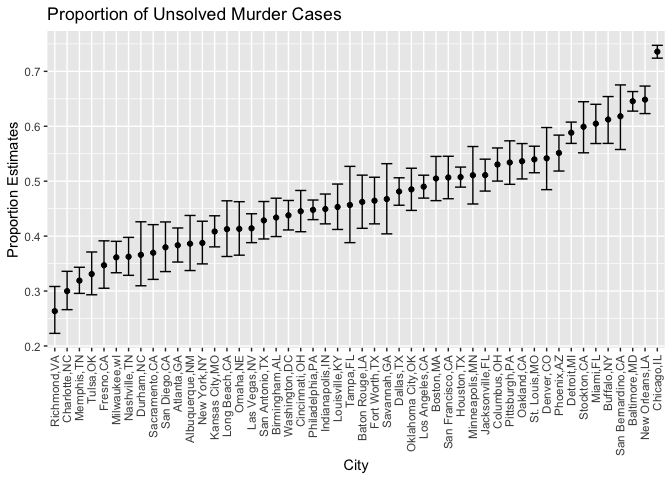

Homework 5
================
Chong Li

# Problem 1

The raw data describes the victim characteristics of murder cases
(name/race/age/sex), the location where the murders took place
(state/city/lat/lon), the identifiers of the cases and the reported
date, and lastly, the disposition of the case (close or open/arrest or
no arrest)

``` r
# Read in the csv file and add the city_state variable, as well as variable for open/no arrest
homicide_df = read.csv("./homicide-data.csv") %>%
  janitor::clean_names() %>%
  mutate(city_state = str_c(city,state,sep=",")) %>% 
  relocate(city_state, .before=lat)  %>%
  mutate(unsolved = (grepl("Closed without arrest",disposition,ignore.case=TRUE) |
                       grepl("Open/No arrest",disposition,ignore.case=TRUE)))

head(homicide_df) %>% kable()
```

| uid        | reported\_date | victim\_last | victim\_first | victim\_race | victim\_age | victim\_sex | city        | state | city\_state    |      lat |        lon | disposition           | unsolved |
| :--------- | -------------: | :----------- | :------------ | :----------- | :---------- | :---------- | :---------- | :---- | :------------- | -------: | ---------: | :-------------------- | :------- |
| Alb-000001 |       20100504 | GARCIA       | JUAN          | Hispanic     | 78          | Male        | Albuquerque | NM    | Albuquerque,NM | 35.09579 | \-106.5386 | Closed without arrest | TRUE     |
| Alb-000002 |       20100216 | MONTOYA      | CAMERON       | Hispanic     | 17          | Male        | Albuquerque | NM    | Albuquerque,NM | 35.05681 | \-106.7153 | Closed by arrest      | FALSE    |
| Alb-000003 |       20100601 | SATTERFIELD  | VIVIANA       | White        | 15          | Female      | Albuquerque | NM    | Albuquerque,NM | 35.08609 | \-106.6956 | Closed without arrest | TRUE     |
| Alb-000004 |       20100101 | MENDIOLA     | CARLOS        | Hispanic     | 32          | Male        | Albuquerque | NM    | Albuquerque,NM | 35.07849 | \-106.5561 | Closed by arrest      | FALSE    |
| Alb-000005 |       20100102 | MULA         | VIVIAN        | White        | 72          | Female      | Albuquerque | NM    | Albuquerque,NM | 35.13036 | \-106.5810 | Closed without arrest | TRUE     |
| Alb-000006 |       20100126 | BOOK         | GERALDINE     | White        | 91          | Female      | Albuquerque | NM    | Albuquerque,NM | 35.15111 | \-106.5378 | Open/No arrest        | TRUE     |

``` r
# count the total number of murder cases as well as unsolved murder cases
cases_df = homicide_df %>%
  count(city_state,name = "cases")

unsolved_df = homicide_df %>%
  filter(unsolved == TRUE) %>%
  count(city_state,name = "unsolved_cases")

sum_df = merge(cases_df,unsolved_df,by.x="city_state",by.y="city_state")

head(sum_df) %>% kable()
```

| city\_state    | cases | unsolved\_cases |
| :------------- | ----: | --------------: |
| Albuquerque,NM |   378 |             146 |
| Atlanta,GA     |   973 |             373 |
| Baltimore,MD   |  2827 |            1825 |
| Baton Rouge,LA |   424 |             196 |
| Birmingham,AL  |   800 |             347 |
| Boston,MA      |   614 |             310 |

``` r
# for the city of Baltimore, use prop.test function to estimate unsolved cases
baltimore = sum_df %>% filter(city_state=="Baltimore,MD")
baltimore_prop = prop.test(baltimore$unsolved_cases,baltimore$cases) %>% 
  broom::tidy() %>% 
  select(estimate,conf.low,conf.high)

signif(baltimore_prop,3) %>% kable()
```

| estimate | conf.low | conf.high |
| -------: | -------: | --------: |
|    0.646 |    0.628 |     0.663 |

``` r
# run prop.test for each cities in the dataset
all_prop = sum_df %>%
  mutate(
    prop_test = map2(.x = unsolved_cases, .y = cases, ~prop.test(.x,.y)),
    prop_test_tidy = map(.x = prop_test, ~broom::tidy(.x))
  ) %>%
  select(city_state,prop_test_tidy) %>%
  unnest(prop_test_tidy) %>%
  arrange(desc(estimate)) %>%
  select(city_state,estimate,conf.low,conf.high) %>%
  mutate(across(is.numeric, ~ round(., 4)))

head(all_prop) %>% kable()
```

| city\_state       | estimate | conf.low | conf.high |
| :---------------- | -------: | -------: | --------: |
| Chicago,IL        |   0.7359 |   0.7240 |    0.7474 |
| New Orleans,LA    |   0.6485 |   0.6231 |    0.6732 |
| Baltimore,MD      |   0.6456 |   0.6276 |    0.6632 |
| San Bernardino,CA |   0.6182 |   0.5577 |    0.6753 |
| Buffalo,NY        |   0.6123 |   0.5688 |    0.6541 |
| Miami,FL          |   0.6048 |   0.5686 |    0.6400 |

``` r
# create a graph based on the prop.test outputs above

all_prop %>%
  mutate(city_state = fct_reorder(city_state, estimate)) %>%
  ggplot(aes(x = city_state, y = estimate)) +
  geom_point() +
  geom_errorbar(aes(ymin = conf.low, ymax = conf.high)) +
  theme(axis.text.x = element_text(angle = 90, vjust = 0.5, hjust = 1)) +
  ggtitle("Proportion of Unsolved Murder Cases") +
  xlab("City") + ylab("Proportion Estimates")
```

<!-- --> \#
Problem 2

``` r
# create a data frame that consists of all subjects and respective observations
study_df = 
  tibble(file_name = list.files("data")) %>%
  mutate(
    data = map(.x = str_c("./data/", file_name), ~read_csv(.x))
  ) %>%
  unnest(data) %>%
  pivot_longer(
    week_1:week_8,
    names_to = "week",
    values_to = "observations"
  ) %>%
  mutate(
    arm_id = substr(file_name, 0, 3),group_id = substr(file_name, 5, 6)) %>%
  mutate(
      group_id = as.numeric(group_id),
      arm_id = case_when(
        arm_id == "con" ~ "control",
        arm_id == "exp" ~ "experiment"
      ),
      week = as.numeric(substr(week,6,6))
  ) %>%
  relocate(group_id,.before=week)%>%
  relocate(arm_id,.before=week) %>%
  select(-file_name)

study_df %>% kable()
```

| group\_id | arm\_id    | week | observations |
| --------: | :--------- | ---: | -----------: |
|         1 | control    |    1 |         0.20 |
|         1 | control    |    2 |       \-1.31 |
|         1 | control    |    3 |         0.66 |
|         1 | control    |    4 |         1.96 |
|         1 | control    |    5 |         0.23 |
|         1 | control    |    6 |         1.09 |
|         1 | control    |    7 |         0.05 |
|         1 | control    |    8 |         1.94 |
|         2 | control    |    1 |         1.13 |
|         2 | control    |    2 |       \-0.88 |
|         2 | control    |    3 |         1.07 |
|         2 | control    |    4 |         0.17 |
|         2 | control    |    5 |       \-0.83 |
|         2 | control    |    6 |       \-0.31 |
|         2 | control    |    7 |         1.58 |
|         2 | control    |    8 |         0.44 |
|         3 | control    |    1 |         1.77 |
|         3 | control    |    2 |         3.11 |
|         3 | control    |    3 |         2.22 |
|         3 | control    |    4 |         3.26 |
|         3 | control    |    5 |         3.31 |
|         3 | control    |    6 |         0.89 |
|         3 | control    |    7 |         1.88 |
|         3 | control    |    8 |         1.01 |
|         4 | control    |    1 |         1.04 |
|         4 | control    |    2 |         3.66 |
|         4 | control    |    3 |         1.22 |
|         4 | control    |    4 |         2.33 |
|         4 | control    |    5 |         1.47 |
|         4 | control    |    6 |         2.70 |
|         4 | control    |    7 |         1.87 |
|         4 | control    |    8 |         1.66 |
|         5 | control    |    1 |         0.47 |
|         5 | control    |    2 |       \-0.58 |
|         5 | control    |    3 |       \-0.09 |
|         5 | control    |    4 |       \-1.37 |
|         5 | control    |    5 |       \-0.32 |
|         5 | control    |    6 |       \-2.17 |
|         5 | control    |    7 |         0.45 |
|         5 | control    |    8 |         0.48 |
|         6 | control    |    1 |         2.37 |
|         6 | control    |    2 |         2.50 |
|         6 | control    |    3 |         1.59 |
|         6 | control    |    4 |       \-0.16 |
|         6 | control    |    5 |         2.08 |
|         6 | control    |    6 |         3.07 |
|         6 | control    |    7 |         0.78 |
|         6 | control    |    8 |         2.35 |
|         7 | control    |    1 |         0.03 |
|         7 | control    |    2 |         1.21 |
|         7 | control    |    3 |         1.13 |
|         7 | control    |    4 |         0.64 |
|         7 | control    |    5 |         0.49 |
|         7 | control    |    6 |       \-0.12 |
|         7 | control    |    7 |       \-0.07 |
|         7 | control    |    8 |         0.46 |
|         8 | control    |    1 |       \-0.08 |
|         8 | control    |    2 |         1.42 |
|         8 | control    |    3 |         0.09 |
|         8 | control    |    4 |         0.36 |
|         8 | control    |    5 |         1.18 |
|         8 | control    |    6 |       \-1.16 |
|         8 | control    |    7 |         0.33 |
|         8 | control    |    8 |       \-0.44 |
|         9 | control    |    1 |         0.08 |
|         9 | control    |    2 |         1.24 |
|         9 | control    |    3 |         1.44 |
|         9 | control    |    4 |         0.41 |
|         9 | control    |    5 |         0.95 |
|         9 | control    |    6 |         2.75 |
|         9 | control    |    7 |         0.30 |
|         9 | control    |    8 |         0.03 |
|        10 | control    |    1 |         2.14 |
|        10 | control    |    2 |         1.15 |
|        10 | control    |    3 |         2.52 |
|        10 | control    |    4 |         3.44 |
|        10 | control    |    5 |         4.26 |
|        10 | control    |    6 |         0.97 |
|        10 | control    |    7 |         2.73 |
|        10 | control    |    8 |       \-0.53 |
|         1 | experiment |    1 |         3.05 |
|         1 | experiment |    2 |         3.67 |
|         1 | experiment |    3 |         4.84 |
|         1 | experiment |    4 |         5.80 |
|         1 | experiment |    5 |         6.33 |
|         1 | experiment |    6 |         5.46 |
|         1 | experiment |    7 |         6.38 |
|         1 | experiment |    8 |         5.91 |
|         2 | experiment |    1 |       \-0.84 |
|         2 | experiment |    2 |         2.63 |
|         2 | experiment |    3 |         1.64 |
|         2 | experiment |    4 |         2.58 |
|         2 | experiment |    5 |         1.24 |
|         2 | experiment |    6 |         2.32 |
|         2 | experiment |    7 |         3.11 |
|         2 | experiment |    8 |         3.78 |
|         3 | experiment |    1 |         2.15 |
|         3 | experiment |    2 |         2.08 |
|         3 | experiment |    3 |         1.82 |
|         3 | experiment |    4 |         2.84 |
|         3 | experiment |    5 |         3.36 |
|         3 | experiment |    6 |         3.61 |
|         3 | experiment |    7 |         3.37 |
|         3 | experiment |    8 |         3.74 |
|         4 | experiment |    1 |       \-0.62 |
|         4 | experiment |    2 |         2.54 |
|         4 | experiment |    3 |         3.78 |
|         4 | experiment |    4 |         2.73 |
|         4 | experiment |    5 |         4.49 |
|         4 | experiment |    6 |         5.82 |
|         4 | experiment |    7 |         6.00 |
|         4 | experiment |    8 |         6.49 |
|         5 | experiment |    1 |         0.70 |
|         5 | experiment |    2 |         3.33 |
|         5 | experiment |    3 |         5.34 |
|         5 | experiment |    4 |         5.57 |
|         5 | experiment |    5 |         6.90 |
|         5 | experiment |    6 |         6.66 |
|         5 | experiment |    7 |         6.24 |
|         5 | experiment |    8 |         6.95 |
|         6 | experiment |    1 |         3.73 |
|         6 | experiment |    2 |         4.08 |
|         6 | experiment |    3 |         5.40 |
|         6 | experiment |    4 |         6.41 |
|         6 | experiment |    5 |         4.87 |
|         6 | experiment |    6 |         6.09 |
|         6 | experiment |    7 |         7.66 |
|         6 | experiment |    8 |         5.83 |
|         7 | experiment |    1 |         1.18 |
|         7 | experiment |    2 |         2.35 |
|         7 | experiment |    3 |         1.23 |
|         7 | experiment |    4 |         1.17 |
|         7 | experiment |    5 |         2.02 |
|         7 | experiment |    6 |         1.61 |
|         7 | experiment |    7 |         3.13 |
|         7 | experiment |    8 |         4.88 |
|         8 | experiment |    1 |         1.37 |
|         8 | experiment |    2 |         1.43 |
|         8 | experiment |    3 |         1.84 |
|         8 | experiment |    4 |         3.60 |
|         8 | experiment |    5 |         3.80 |
|         8 | experiment |    6 |         4.72 |
|         8 | experiment |    7 |         4.68 |
|         8 | experiment |    8 |         5.70 |
|         9 | experiment |    1 |       \-0.40 |
|         9 | experiment |    2 |         1.08 |
|         9 | experiment |    3 |         2.66 |
|         9 | experiment |    4 |         2.70 |
|         9 | experiment |    5 |         2.80 |
|         9 | experiment |    6 |         2.64 |
|         9 | experiment |    7 |         3.51 |
|         9 | experiment |    8 |         3.27 |
|        10 | experiment |    1 |         1.09 |
|        10 | experiment |    2 |         2.80 |
|        10 | experiment |    3 |         2.80 |
|        10 | experiment |    4 |         4.30 |
|        10 | experiment |    5 |         2.25 |
|        10 | experiment |    6 |         6.57 |
|        10 | experiment |    7 |         6.09 |
|        10 | experiment |    8 |         4.64 |
